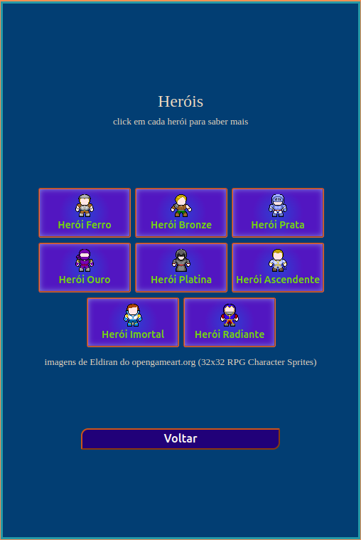

# Desafio Hero Santander 
Projeto do Bootcamp Godot Santander

## DESAFIO DIO - Classificador de Nível de Herói


```
Entendendo o Desafio
 
Instruções para entrega

# 1️⃣ Desafio Classificador de nível de Herói

**O Que deve ser utilizado**

- Variáveis
- Operadores
- Laços de repetição
- Estruturas de decisões

## Objetivo

Crie uma variável para armazenar o nome e a quantidade de experiência (XP) de 
um herói, depois utilize uma estrutura de decisão para apresentar alguma das 
mensagens abaixo:

Se XP for menor do que 1.000 = Ferro
Se XP for entre 1.001 e 2.000 = Bronze
Se XP for entre 2.001 e 5.000 = Prata
Se XP for entre 5.001 e 7.000 = Ouro
Se XP for entre 7.001 e 8.000 = Platina
Se XP for entre 8.001 e 9.000 = Ascendente
Se XP for entre 9.001 e 10.000= Imortal
Se XP for maior ou igual a 10.001 = Radiante

## Saída

Ao final deve se exibir uma mensagem:
"O Herói de nome **{nome}** está no nível de **{nivel}**"

```


## Demonstração

[Acesse e conheça](https://1001utilidades.online/bootcampgodotsantander/desafiohero "Insira um gif ou um link de alguma demonstração")


## Screenshots





## Tecnologias utilizadas

1.  

2.  

3. 

